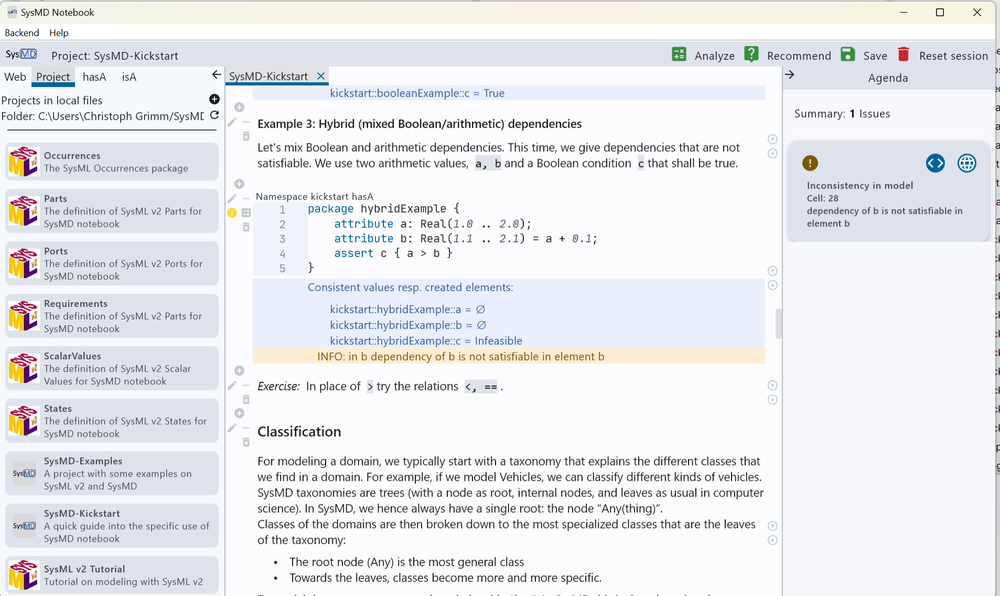

# SysMD Notebook

SysMD Notebook is an environment for working with SysML v2 and KerML.
It supports the creation of documentation in Markdown, requirements, specifications, and system models.

Key features include:

- **Document cells** that are linked to a model in a notebook-style interface, combining documentation and executable content.
- **Model cells** that can be executed to compute values and check consistency.
- A unified notebook UI where document and model cells are seamlessly integrated.
- The ability to exchange content as Markdown documents (e.g., via email), enabling collaboration with stakeholders who are not experts in systems engineering.

A key differentiator of SysMD is that models—such as requirements, constraints, and calculations—are **executable**.
By “executable models,” we mean that an **integrated constraint solver** can:
- verify the consistency of SysML v2 models, and
- automatically compute missing values.

This is conceptually similar to how Excel supports early system analysis, but SysMD provides a more advanced approach (comparable to SAT/SMT solving) that is fully integrated with SysML v2.

SysMD Notebook's UI looks as follows:



The links below give a brief introduction into SysMD Notebook (Kickstart) and SysML v2.
Note that these Markdown-Documents with its integrated SysML v2 and KerML models can be edited
(and computed!) with SysMD Notebook:
- [Kickstart for the SysMD Notebook UI](install/1-SysMD-Kickstart/SysMD-Kickstart.md)
- [Kickstart_for modeling and computing with SysMD Notebook](install/1-SysMD-Kickstart/SysMD-Modeling.md)
- [SysML v2 Tutorial, Introduction](install/3-SysMLv2Tutorial/SysMLv2Tutorial.md)
- [SysML v2 Tutorial, Ecosystem](install/3-SysMLv2Tutorial/ecosystem.md)
- [SysML v2 Tutorial, KerML](install/3-SysMLv2Tutorial/kerml.md)
- [SysML v2 Tutorial, SysML v2](install/3-SysMLv2Tutorial/sysml.md)

> These Markdown files are also available after starting SysMD notebook as Projects. 
> Then, one can see how the solver computes and constrains values in the rendered documents. 

The compiler translates model cells into the SysML v2 abstract representation (KerML metamodel). 
On this metamodel, the constraint solver checks the consistency of

- values and
- units

and returns an over-approximation of values that satisfy all constraints or an empty set if no consistent values exist.

- [Scientific Papers](doc/publications/papers.md)
- [Overview of SysMD specific extensions](doc/SysMDLanguageExtensions.md)
- [List of supported units](doc/AvailableUnits.md)
- [Modeling of time and date](doc/Time.md)

Also, in the folder 'doc' some documentation is provided.

## Running SysMD Notebook

### Via binary installer

1. Make sure you have at least Java 21 installed on your Computer.
2. Download the installer of the SysMD Notebook from the 'releases' page in GitHub (https://github.com/tukcps/SysMD/releases)
3. Run the Installer and use the SysMD Notebook.

Note that eventually on Windows or OS X you have to permit installation of non-signed software in the security settings.  

### Via Gradle

To run the frontend, just use the build system Gradle: 

```
./gradlew bootRun
```
resp. on Windows systems: 

```
gradlew.bat bootRun
```

### Troubleshooting

If the build or startup fails, verify that the required tool versions are installed:

```bash
java --version      # Java 21+
./gradlew --version # Gradle 8+
```

If you are connected to a corporate network, Gradle may require proxy access to download dependencies from external repositories. If dependency resolution fails, check the proxy settings in `gradle.properties`.

Example:

```properties
systemProp.http.proxyHost=cloudproxy.yourdomain.com
systemProp.http.proxyPort=8080
systemProp.https.proxyHost=cloudproxy.yourdomain.com
systemProp.https.proxyPort=8080
```

Please contact your IT support team if you are unsure about the correct proxy configuration.

## Creating installer

To create a platform-specific installer, use the Gradle target  ```generateSysMDInstaller```.
It is part of the Task-group `sysmd`.

```
./gradlew generateSysMDInstaller
```

# Access via REST
SysMD notebook can also be used via REST in a headless mode. 
Check the swagger API documentation after start under the local URL
http://localhost:8081/swagger-ui/index.html#/

# Supported and unsupported parts of KerML and SysML v2

SysMD Notebook is a work in progress and does not (yet) support the full range of KerML and SysML v2.
However, a significant subset is supported with a focus on the intended use case.
The following gives some indications on what is supported: 
 
- _Supported_: modeling of packages, items, parts, ports, interfaces, connections, attributes, calculations, expressions, requirements, constraints, states; both usages and definitions.
- _Not supported_: time slices, user-defined keywords, views, etc. 

Note that automata and states might compile, but the constraint propagation mechanism does not use the respective parts properly. 
Also, KerML is implemented with support for features, classes, packages, expressions, etc. -- but with some restrictions for expressions.  


# Acknowledgements 

SysMD was developed and is maintained by
- University of Kaiserslautern-Landau, Chair of Cyber-Physical Systems 
  - Christoph Grimm (RPTU)
  - Sebastian Post (RPTU)
  - Axel Ratzke (RPTU)
  - Carna Zivkovic (NXP)
  - Theogene Uribumeneshi (RPTU, NXP)
  - Moritz Schuler (RPTU)
  - Moritz Herzog (RPTU)
  - Nicolas Theobald (RPTU)
- HOOD Group
  - Bertil Muth
  - Markus Eberhard

The solver very much profits from the AADD library for computation with ranges:
- https://github.com/tukcps/Multiplatform-AADD

The work was partially supported by EC and German BMBF within the research projects 
- Arrowhead Tools (EC & BMBF)
- GENIAL! (BMBF)
- KI4BoardNet (BMBF)
