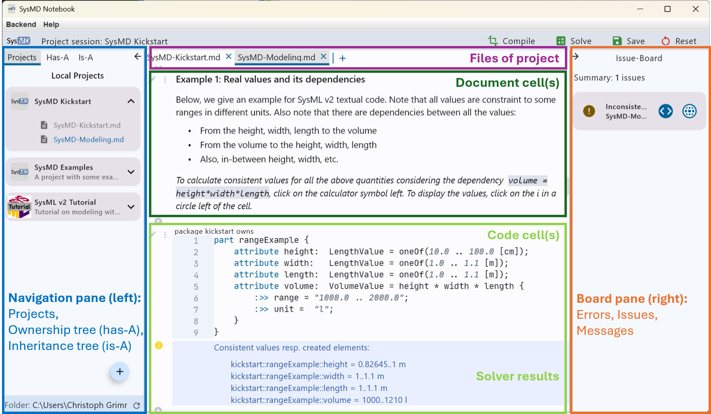
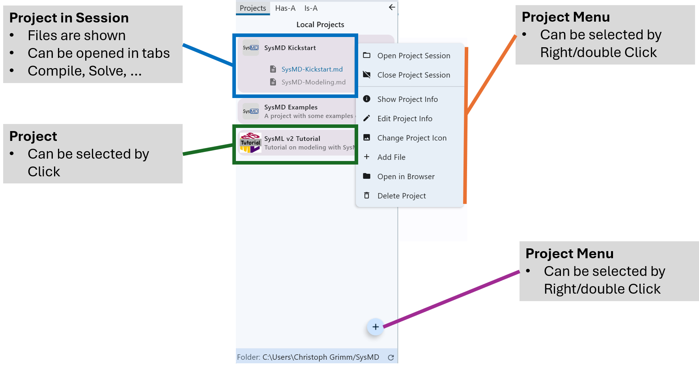

[toc]

# SysMD Notebook Overview

We distinguish between the SysMD Notebook *tool* and the SysML v2 *language extensions* SysMD.

The *tool* permits editing *documents* that consist of *cells* that can be
- documentation written in Markdown, or
- models written in the language SysMD itself.  

The *language extension* extends SysML v2 to better support 
- interactive work,  
- integration in Notebook-like environments, 
- formulation of constraints and ranges does not require these extensions; however, we have libraries in standard KerML for that purpose.

In the following, we first give an introduction to the SysMD Notebook, and then a  
brief overview of the SysML v2 textual language constructs as supported by SysMD. 
The figure below gives an overview of the SysMD Notebook User Interface (UI). 

{width=800 height=500}

SysMD Notebook consists of 
- The left pane in which **projects** are selected and edited. 
- The main window, in which the **files** of a project are edited; they are each displayed as a sequence of **cells**.
- Each cell can be of different kind; depending on the kind, a renderer or editor is chosen. 
- In the right pane, **issues** and **errors** are listed. 

## Projects

To create a new SysMD project, select the rider “Project” in the left panel.
It is shown below.

{width=700 height=500}
 
### Creating a project

Click on the large "+" icon at the bottom of the Navigation pane.
This opens a dialog in which you can enter the data for the project: 

- name of the project, 
- description of the project,   
- maintainers of the project, 
- license of the project (t.b.d.), 
- usages of the project (t.b.d.)

The path in which all projects are saved is shown on the bottom of the panels.
You can edit the path; the default is 'SysMD' in the user's home directory.

### Updating a project

Right-Click (depending on the platform) in the project's card. 
This will open the project update menu, where you can choose to

- Open/close a project session in which you can edit files, compile, solve, etc. them. 
- Edit the project information.
- Change the project's icon.
- Add files to the project.
- Open a browser to directly access the files edited.
- delete the project.
The project is actually not deleted, only marked as deleted by adding a suffix `.deleted`. 

> In case something goes wrong, the project is still in the directory with a suffix '.deleted'.
> In the files .project.json and .meta.json you find further settings - see below. 

A project consists of files that are shown as tabs. 
We describe them next. 

## Files/Tabs

A project consists of multiple _files_.
They are persisted in an interchange project in the directory shown on the bottom of the navigation pane. 
The files appear once a project is opened as tabs in the main window of SysMD Notebook.
As a good practice, a file can be considered as a subchapter of a specification document 
(or an interactive tutorial like this kickstart or the SysML v2 tutorial).

### Creating, (re-)naming, and deleting files

In SysMD, each project consists of multiple files.  
Currently the files are in Markdown format.
This allows us to exchange documents with stakeholders that are not modeling experts and do not have a focus on modeling.
In future also SysML/KerML export following standard might be supported.
Each file is saved in the interchange project's folder.

The project's folder is by default in the user's home directory and by default called 'SysMD.' 
In this folder the project folder is created in a directory with the same name as the project's initial name.

In the project folder are

- an initial file created together with the project. 
- a file `.project.json` that holds the main project data. 
- a file `.meta.json` that holds an index of all files that belong to a project. 
- additional files if added. 

Note that deleting a file in SysMD will not delete it from the computer, 
it will only be removed from the index. 

### Adding, deleting, and renaming files 

In SysMD Notebook, files of a project are opened and shown as tabs in the main window.
We can close some of them in case there are too many files. 
To add, delete, or rename files of a project, right-click on the file of an active project-session. 
 
Note that some options are not yet available via the UI. 
 
- Usages can be added to the file `.project.json`. 
- Multiple source files are registered in `.meta.json`, but as SysMD uses MD, 
  it in this respect is not compliant with the standard (export of compliant SysML and index is WiP). 
- All files are saved in the Markdown format; 
  SysML v2 and KerML textual representations are saved in code parts of the Markdown documents.   

## Cells

Each file is structured into *cells*.
A cell can be of the kinds

- _Documentation_ that is written in the "Markdown" Language that is between a 
  What-You-See-Is-What-You get Editor like Word or Excel and pure text. 
  Markdown allows us to document our model in a structured way, including a document structure 
  (Chapters, Sections, etc.), Pictures, Tables. 
  This helps us to better explain how we came to requirements – and others to understand it as well. 
  In SysMD, Documentation is tightly interwoven and linked (via Relationships) with more formal, textual models.
  
- _Textual representation_ of a model. 
  We can formulate models in the modeling languages SysMD or a subset of SysML v2 textual. 
  Both languages are translated into SysML’s KerML metamodel class instances and can be exchanged via the SysMLv2 API. 

### Add and Delete Cells

A new SysMD document is empty in the beginning. 
To add a cell, click on the small gray circle with a "+" that is shown. 

It adds a document-cell, either in the start, the end or between existing cells.
Now you have created your first document-cell.
Left of each document-cell, icons are shown. 
If an element is not selected, they are gray;
if an element is selected, the icons are in different colors. 
If the mouse is over an icon, SysMD notebook shows an explanation what action is done when clicking the item. 
To delete an element, select the trash bin, to edit the pencil, 
and to minimize the document-cell, select the “-”.

## Documentation vs. Code-Cells. 

Markdown is _easy_ to learn, efficient, and effective.
The following text shows how to create a third level heading, how to emphasize; 
just to give you an example. 

*Double-click into the cell below!*  

### Try: Third level Heading; click here! 

Below an item list:
- This is *emphasized*.
- This is **Bold**.
- This is ++underlined++.
- This is ~~strikethrough~~. 

Double click into this cell to edit it.
You want to learn more on Markdown? 

[[Learn more about Markdown by clicking this link!]](https://www.markdownguide.org/getting-started/)

Note that SysMD Notebook also renders LaTeX equations like $\alpha = \sum_{x=0}^{100} x$.
