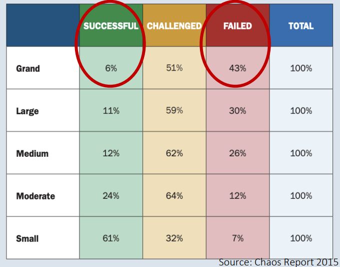
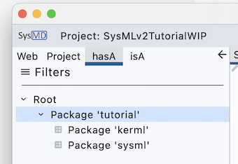

# SysML v2: Why Why Why? 

The first known complex project reported by literature [Genesis 11:1–9] 
is the tower of Babel:

>“… let’s confuse their language, so that they
>may not understand one another's speech. …
>, and they left off building the city.”

Mutual understanding is the key skill to building complex, 
heterogeneous systems. 

{width=400 height=300}

Unfortunately, the tower of Babel is just the first in a history of failed big projects.
Today many “big” projects fail, in all domains including also HW/SW development projects.
Reasons for the failing include in particular are related to requirements, use cases,
specification that

- are incomplete, unknown, 
- not well understood in the beginning, 
- change during development (or operation), 
- have inconsistencies.

The [chaos report](https://www.standishgroup.com/sample_research_files/CHAOSReport2015-Final.pdf) gives a more detailed overview of such problems and statistics on
the resulting problems. 

{width=400 height=300}

The above-mentioned issues are expensive to fix lately. 
SysML offers a solution that permits its exchange among stakeholders with the following advantages:
- SysML v2 offers a standardized solution
- US DoD might request SysML v2 models

# Objectives and contents of the tutorial
## Learning objectives 
---
This tutorial introduces the basics of SysMLv2. 
After reading it you will 
- understand when and for what to use SysMLv2
- be able to 
    - create models using SysMLv2 textual
    - use SysMD notebook to execute the models
- know  
    - how KerML creates a basic framework for SysMLv2
    - the most important structural elements of SysML v2 and KerML

Note that the tutorial  
- has a focus on the textual representation, and does not introduce the diagrams
- has a focus on the structural elements, and introduces little of behavior
- provides integrated examples after many sections that you can try directly
 
--- 
## Parts of the tutorial

The tutorial consists of 4 parts that stepwise introduce you to SysMLv2: 

- Introduction (this file!)
- [The SysMLv2 Ecosystem and Methodology](ecosystem.md)
- [KerML - the Basis of SysMLv2](kerml.md)
- [SysMLv2](sysml.md)
- [API and Model Exchange](api.md)
 
## Hands-on Examples with SysMD Notebook 

The tutorial includes code cells in which examples are shown.
The examples of the respective sections are added as packages to the package "tutorial."
You can 
- execute all models by pressing the "Analyze" button in the main menu, or
- execute the single models, step by step by pressing the calculator icon left of a code cell. 

The figure below shows the menu that is left of each cell. 
It opens after clicking on the dots. 

{width=600 height=300}

Try selecting the dots and then "Compile and solve" with the following code cell: 
```SysML
    package tutorial {
      package kerml; 
      package sysml; 
    }
```
By this action, you translate the textual model into an abstract representation. 
The abstract representation consists of all elements that are part of the model.
They are shown in the "hasA" tree view left. 
Open the "hasA" tree view left by opening it and clicking on "tutorial." 



The package `tutorial` is added to the model after execution of the cell.
You can see it in the tree-view left after pressing "analyze" in the main 
menu or the "calculate" button left of the cell.

_Do not change the name of or even remove the package `tutorial`!_ 

_We need it to add models to it later._ 
