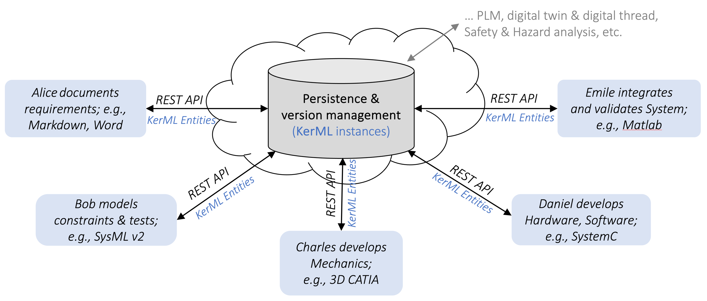
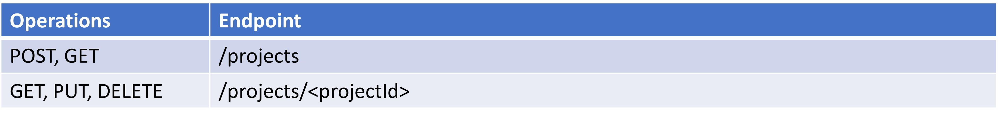
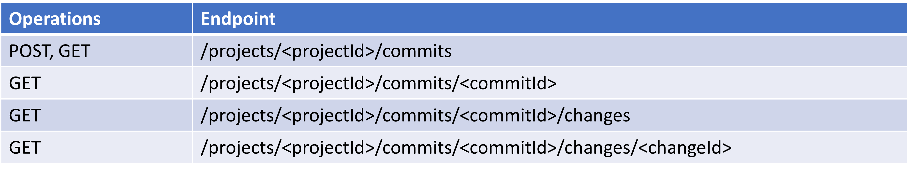
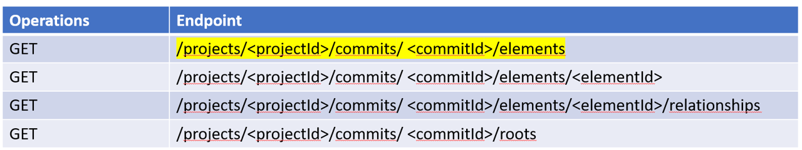

[toc]

---
**Learning objectives**

In this part, you will learn about the REST API that is standardized part of
SysML v2. After reading the part, you will

- know basics of REST and JSON, 
- understand when to use GIT and when to use the REST API,
- understand how to use the REST API. 

---
# Introduction

The vision behind the SysML v2 API has already been mentioned.
It is the ability to persist and exchange SysML v2 (and other) models in a scenario as shown
below.

{width=1000 height=400}

Basically, the Standard SysML v2 as introduced before consists of the parts
KerML, SysML v2, and API.
Where SysML v2 itself is not related to the data exchange and versioning,
KerML and API are both strongly related as can be seen in the picture above:

- KerML is used as a format for exchange of data, and
- API defines functions of tools to be used.
## SysML v2 model exchange and version management
### Exchange of models via files

From a user's point of view a model consists of files.
The files eventually contain textual models in ASCII or other encondings.
Hence, files with program text are the first way to exchange models.
Then, one can save a file and send the file e.g. for exchange to collaborators.
Even more: files can easily be hosted on e.g. a Gitlab server.
This permits the versioning (branches, merges, etc.) on text based models.
_Versioning via Git is clearly of advantage during the development of textual models. _

For data exchange via textual models, SysML v2 also defines the layout of directories.
For example, they shall also contain a JSON file with the overall project setup and
a list of project and their versions that are required for building execution of the model.

> For purely model development activities and version management during model development,
> it best to use e.g. Git as a version management tool and to represent models by its
> textual representation. However, once dependencies become more complex, and a management
> of pieces e.g. during operation is needed, one should consider using the REST API of 
> SysML v2. 
### Exchange of models in the cloud

In particular at enterprise level, in production use, one might want to retrieve single artifacts of a model.
For example a specific part, or a list of all parts required to build a system.
This use case is very suitable for the API part of the SysML v2 standard.
Unlike Git, the SysML v2 API assumes a set of functions that can be either platform-independent
or platform-dependent. 

A platform-dependent API that is carefully described is the REST API.
### Capabilities of the REST API

The REST API allows persisting models in its compiled, abstract representation of KerML elements.
This makes it easy to identify and version single parts or other elements.
Versioning of elements in the abstact representation e.g. via Git is not possible as Git only knows
about lines of code, but not the single artifacts in the abstract KerML representation, e.g. 
concrete parts. 

Furthermore, the REST API includes interfaces to
- create and manage *projects*, 
- to create *commits*, 
- to organize commits in different *branches*, 
- to trace changes, compute differences (*diff*) between commits, *tag* commits, and
- to retrieve *elements*

These functions can be accessed via interfaces, i.e. a so-called REST API. 
## REST Basics

SysML v2 std. gives API for different platforms and platform-independent ways to access the data in a backend.
In this tutorial we focus on the popular standard REST.

In REST, data in a backend can be retrieved by accessing URLs like a browser does.
Typical for REST is, that the URL used contains all information that is needed to fulfill a service.
In particular, there is not state inbetween different accesses.
An example for a REST call is:

  ```https://mycompany.com/specs/projects/$ID```

A REST API offers a number of such URLs to access different services.
The URLs via which services are accessed are also called _endpoints_.Depending on the direction of a transfer, operaions on an endpoint are differentiated into: 

- POST – transfer a new, complete element
- PUT – transfer a complete existing element
- PATCH – transfer changed fields of element
- GET – get an element
- DELETE – delete an element
## JSON

Data that is exchanged via the REST API is usually in the JSON format (Actually, one might also use
XML which is however not often used).

JSON stands for JavaScript Object Jotation and is the usual standard for representing
objects in a textual way. This is called _serialization_. 
By the endpoints, hence JSON representations are posted, put, patched, etc. 

 
# REST API endpoints

In a SysML v2 backend database, elements are persisted and organized in projects and commits. 
Hence, to persist some data one must first create a project, and can then create a commit 
with some elements of a model. 
Then, one can get a concrete elements from the backend via the respective endpoint for a project 
and commit. 

Projects, commits, elements and other artifacts are identified by an ID. 
The ID is usually a UUID4 identifier that is a 128 bit random number.

A UUID4 identifier can be generated simply randomly even in distributed systems without
checking in a central point whether the ID is already in use -- for 128 bit random numbers
the chance of generating an existing ID is extremely low. 

Furthermore, UUID5 identifiers are used for standard library elements. e.g. ```Base::Anything```.
 
## Projects

To create a new project or get an existing project, one can use the endpoint ```/projects```.

{width=1000 height=150}
## Commits

To create a commit, one first needs to get the respective project id.
Then, one can use the endpoint ```/projects/<projectId>/``` to post or get a project or the changes.


{width=1000 height=220}
## Elements
To get Elements of a commit, one needs to have a project id and a commit id. 
Then, one can get all elements of the commit, or a single element with known id.

To traverse a model, one can start with the elements at the root namespace.
And then follow relationships (ownership, specialization, etc.). 

{width=1000 height=300}
