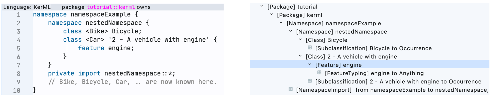
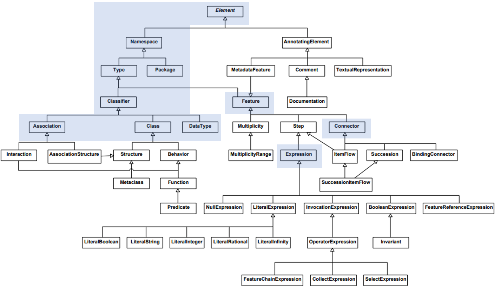
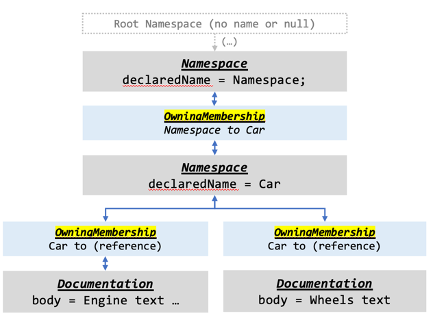

[toc]

---

**Learning objectives**

In this part of the tutorial, we introduce KerML, which provides the foundations for understanding SysML v2. 
After reading the part "KerML," you

- are able to create simple, textual models

- understand 
    - the architecture of SysML
    - the differences between classifiers and features
    - the use of packages and import of namespaces
    - the basic syntactic patterns of KerML and SysML

- know
    - the difference between the textual representation and the abstract representation

- have an overview of 
    - different kinds of classes in the abstract representation of KerML

--- 
# KerML and SysML
The SysML v2 ecosystem builds on top of a basic and simple language: 
KerML (Kernel Modeling language).
KerML is used as a kind of internal representation and starting point throughout the whole ecosystem.  
In consequence, we start the tutorial with a description of the KerML.

KerML has several purposes: 

* Its classes specify the so-called _Metamodel_. 
The Metamodel describes the means to specify models, and gives basic semantics.
* Instances represent concrete models are the basis for persistence and exchange of models; they can be given
  * in an abstract way by elements and relationships between them in arbitrary representation ("abstract representation").
  * in a concrete textual model ("textual representation").

The abstract representation is the foundation, for example, for model exchange in formats like JSON or XML; 
see part "API." 
The textual representation allows users to specify models. 

KerML and SysML are structured in different layers.
The layers introduce, step by step and building on top of each other, more and more features.
The table below gives an overview of the KerML layers, including SysML v2. 
Note that SysML v2 can be seen as a domain-specific library based on KerML. 

| **Layer**    | **Adds**                               | **Classes**                                                                          |
|--------------|----------------------------------------|--------------------------------------------------------------------------------------|
| KerML Root   | Syntactic structure                    | Element, Namespace, Annotation, Membership, ...                                      |
| KerML Core   | Semantic by logic                      | Type, Feature, Multiplicity, ...                                                     |
| KerML Kernel | Semantic library                       | Class, Datatype, Expression, Package, Association, Connector, Behavior, ...          |
| SysML v2     | Domain-specific library based on KerML | Definition & Usage of Attribute, Part, Port, Connection, Interface, Requirement, ... |

KerML (and SysML) both distinguish two different representations: 
The _textual representation_ is written text, like a programming language.
It is translated by a compiler into an _abstract representation_ that consists of elements that are part of the Metamodel description.
These elements can be serialized, analyzed, etc. 
In SysMD, one edits the textual representation in a notebook cell (see figure below, left). 
After compilation, the abstract representation is shown in the "has-a" tree view (see figure below, right).

{width=1000 height=250}

The figure below gives an overview of the KerML classes (without the relationships).
In the tutorial, we focus on the classes highlighted in blue.



In the following, we explain the main classes of the KerML layers. 
# Root Layer
The _Root_ Layer of KerML deals with 
1) the hierarchical (de-)composition of a model, and how to find an element in a model by its name,
2) the life cycle of elements in a model, and
3) modeling of relationships between elements.

> The Root Layer of SysML introduces no specific semantics; 
> it just provides infrastructure for modeling. 

In the following, we introduce three main artifacts of the Root Layer
- Element
- Relationship
- Namespace
- Annotating Elements

## Elements

All artifacts in KerML and SysML are different kind of "Elements". 
`Element` is the base class for all kinds of Elements in KerML, and all other classes inherit its features. 
It provides the means for  
- the identification and 
- the hierarchical composition of models. 

For **identification**, each element has the properties 
- `elementId`, a UUID v4 (=random number) or for standard libraries or, a UUID v5 (=hashcode of qualified name), 
- `name`, a String usually given by the user (declared name; optional), 
- `shortName`, a String usually given by the user (declared short name; optional). 

In the textual representation, names can lexically be written as a basic name, or an unrestricted name. 
- A **basic name** starts with a letter or an underscore (_), followed by letters or numbers. 
- An **unrestricted name** is a sequence of characters enclosed in single quotes.
it can consist of arbitrary symbols except backslash or single quotes.

Examples for valid names are:
- `name1`
- `_123`

Examples for unrestricted names are:
- `'This is a valid unrestricted name'`
- `'1.2'`

Each element can own other elements respectively, be owned by an owner.
This is internally represented by an Element of kind `OwningMembership`, which is a kind of Relationship.
A fundamental principle of KerML and SysML is that all relationships, including ownership are represented 
by reified kind of Relationship.

## Annotating Elements

The most basic and simple elements are annotating elements.
Don't confuse them with annotations that are relationships as shown later. 
An annotating element adds complementary information to a model.
For this purpose, it has, in addition to the properties of an element, a body. 
Specific kind of AnnotatingElement are
- `Comment` and
- `Documentation` (starting keyword: `doc`) with a property `body` that holds the comment resp. documenting text.
- `TextualRepresentation` (starting keyword: `rep`) with a property `body` that holds source code,  
  and a property `language` that holds a string that gives the language of the model, e.g., SysML, or
- `Metadata`

**Example**

In the example below, we add a Documentation and two comments to the package tutorial::kerml.
```KerML::tutorial::kerml
doc kermel /* The package tutorial::kerml is the top-level package that owns all artefacts of the tutorial. */ 
comment /* The owning package is specified in the header of each SysMD cell. */ 
comment c1 about tutorial /* Comments and Documents can have names! */ 
```

## Namespace

A namespace provides the means to retrieve elements by its name or short name.
In this context, a **qualified name** describes a path from an element to another element in a 
hierarchy of elements.
In a qualified name, different names are called segments, and they are separated by "::". 

Namespaces can **import** single or all elements of other namespaces via "imports."
In KerML, an import is a relationship between an importing namespace and 
- an imported namespace (all elements are imported), or 
- a single element.
It makes imported elements visible directly in the importing namespace. 

>The process of searching an element by its name is called _name resolution_.

**Example**

Below, an example with two nested namespaces is given.
Note that the syntax schema throughout KerML and SysML is to start all elements by
- A keyword that gives its kind, that is the respective KerML, SysML class by convention in small letters.
- Optionally, a name and short name  (in < .. >) and/or name 
- Optionally, a body in curly braces where owned elements are modeled

In the example, the qualified name `namespaceExample::Bike` refers to the Bike of the 
namespace owning the namespaceExample. 
```KerML::tutorial::kerml
namespace NamespaceExample {  
  namespace Car {
    doc /* Engine text … */
    doc /* Wheels text … */ 
  }
}
```
- Execute the example by pressing the "compile and solve" left of the cell.
- Check what happens in the "hasA" tree view left inside "tutorial", "kerml"!

The figure below shows the abstract representation generated by the example:
- Elements without an owner are in the "root namespace"; in SysMD, the cell is attached to 'tutorial::kerml'.  
- In the concrete example, these are an element Namespace 'NamespaceExample'.
  This Namespace owns two elements of type "Documentation" that have no names. 

{width=550 height=330}


>**Warning**: 
> SysMD permits executing code in cells in a given namespace (selected in the line above the cell). 
> The whole tutorial is part of the namespace `tutorial`. 
> The concrete example is executed in an isolated namespace `tutorial::kerml`, where `NamespaceExample' is added.
> This is not (yet?) part of the standard, where every cell would have to be in the root namespace.

## Relationship

A relationship is a kind of KerML element that models a relationship between elements. 
In addition to an element, a relationship has the properties
- `source`, and
- `target`. 

Source and target are (ordered) collections of _references_ to elements.
Relationships are used as reified objects to model all kinds of relationships,
in particular also the ownership between elements and its owning element. 

From the user's perspective, `Annotation` is an important kind of elements in the Root layer of KerML.
An Annotation is a relationship between Annotating Element and an annotated element. 

> We come back to relationships later in the Kernel Layer.

## Annotating Elements 

# Core Layer

The core layer introduces _types_ to describe and classify things that exist 
in an imaginary or the existing universe.
For this purpose, a type introduces a relationship `Specialization` or a more specific kinds thereof. 
This relationship relates each type to a more general type.

The most general and predefined type is `Base::Anything`.
All types are subtypes of this type. 

> The set of things classified by a type is the extent of the type.
> Each member of (the extent of) a type is an instance of the type.
> (OMG, KerML)

For example, we can introduce a type `Vehicle` with the extent of all vehicles.
An individual vehicle would then be an instance of this type.

KerML introduces two different kind of types, each with different purpose: 

- Classifier, and
- Feature.
## Classifiers

SysML v2 has an ontological foundation. 
Classifiers are types that classify single things in an imaginary or the real universe. 


The Kernel layer (see below) further refines the ontological semantics of classifiers into: 

- Class
- DataType 

## Features

A feature is a kind of type that allows us to model constraints 
that specify how things relate to each other. 
For example, we can we can _feature_ a type ```Vehicle``` by saying that
it has (in the sense of owns, as parts) the features ```engine``` and ```wheels```, 
and that it relates to a ```driver```.
Specifying features of a type is called **type featuring**. 

Note that features of a type also have a type, i.e., wheels are 
elements that are typed by a class `Wheel`, and engines are typed by a class `Engine`.
Specifying the type of feature is called **feature typing**.

Furthermore, a feature can be a subset of other features in a model.
For example, the front wheels of a vehicle are not two additional wheels, 
but a subset of all its wheels. 
This is called **subsetting**. 

A type, hence, also a feature, inherits the features of its general type: 
If all vehicles have one or more wheels, then also some special kinds of vehicles have one or more wheels.

Features also have a **Multiplicity**.
A Multiplicity allows giving constraints on the number of features.
# Kernel Layer

The Kernel layer introduces specific classes with more complex semantics, including
- DataTypes, Classes
- Packages
- Structures 
- Behavior
- Functions and Expressions
- Associations and Connectors 
## DataType, Class 

The Kernel layer differentiates Classifiers into
- data types (keyword `datatype`, KerML class DataType), where occurrences are non-distinguishable individuals.
  For example, two occurrences or a Real number _pi_ mean the same number, and not two different ones.
  Hence, Real numbers are a data type.
- classes (keyword `class`, KerML class Class), where occurrences are distinguishable individuals. For example, two instances of the Class
  Cars might have the same features, but are nevertheless two different instances.

The standard library `ScalarValues` introduces some basic data types, including
- Boolean; it can be referred by its qualified name: `ScalarValues::Boolean`.
  Alternatively, you can import the namespace `ScalarValues` in the current namespace (`private import ScalarValues::*`).
  Then, you can directly refer the type by `Boolean` 
- Integer (`ScalarValues::Integer`)
- Real (`ScalarValues::Real`)


Note that Reals have no accurate representation on computers; 
they are, for example, represented by symbolic representations.
For execution or computations, approximations like floating point representations must be used. 

SysMD computes with data types. In SysMD, a `ScalarValues::Real` value is represented by
- _min_: a floating point representation that is smaller than the true value
- _max_: a floating point representation that is bigger than the true value
- flags to handle overflow and results like division by zero (NaN)

Also, all kind of types inherit the features of its general type. 
See below for an example. 
## Package

A package (keyword: `package`, KerML class: Package) is a kind of namespace. 
It directly serves as a hierarchical container for other elements, and that has no other purpose than this.
```KerML::tutorial::kerml
package vehicleLibrary {
    // some elements inside library 
    class Engine; 
    class Wheel; 
    class Vehicle {
        feature engine: Engine [0..*]; 
        feature wheel: Wheel [0..*]; 
    }; 
    class Bicyle :> Vehicle {
        feature engine redefines engine: Engine [0..0]; 
        feature wheel redefines wheel: Wheel [2..2]; 
    }; 
    class Car :> Vehicle {
        feature engine redefines engine: Engine [1..*]; 
        feature wheel redefines wheel: Wheel [4..4]; 
    }
}
```
## Associations and Connectors 

Relationships can only be identified by its name and that cannot be classified or

Associations are relationships.
```KerML::tutorial::kerml
package associationsAndConnectors {
    class A;
    class B;
    assoc r {
        end feature end1: A;
        end feature end2: B;
    }
}
```
```KerML::tutorial::kerml::associationsAndConnectors
    feature a: A; 
    feature b: B; 
    connector c: r from a to b; 
```
## Functions and Expressions

Remember the differences between Classifiers and Classes and Features.
The same kind of difference also exists between Functions and Expressions: 

- Functions are specific kinds of Classes and classify different kinds of behavior, and
- Expressions are specific kinds of Features that model concrete functions. 

In the following, we focus on expressions. 
Expressions have 
- start with the keyword `expr`
- have, like all elements, an identification by name, short name, id; 
- are typed by a type given as in a feature; 
- can be bound to the value of another expression, i.e., by `=` followed by the other expression.  
Semantics is given in a denotational way. 
This means that the result of an execution shall ensure that the values are the same resp. that there is only one value.

Invariants are a specific kind of expression. An invariant
- starts with the keyword `inv`, eventually followed by an identification; 
- is typed by Boolean and always evaluates to `true`; 

Below are some examples.

**Example: Model-Level Evaluation 

```KerML::tutorial::kerml 
package expressionExamples {
    package expressionEvaluation {
        private import ScalarValues::*;
        function Area {
            in w: ScalarValues::Real;
            in l: ScalarValues::Real;
            return area: ScalarValues::Real = w*l;
        }
        feature w1: Real = 3.0;
        feature l: Real = 2.0;
        feature area: Real = Area(w1, l);
    }
}
```

**Example: Boolean expressions**

It has two Boolean variables, a and b that are free variables of type `Boolean`. 
An assertion `c` is bound to the value `true` and to the expression `a and b`. 
```KerML::tutorial::kerml
package expressionExamples { 
    package booleanExample {
        feature a: ScalarValues::Boolean;
        feature b: ScalarValues::Boolean;
        inv c { a and b }
    }
}
```
**Example: Mixed Boolean/arithmetic expressions**

One can also add predicates as shown in the example below.
```KerML::tutorial::kerml::expressionExamples
    package hybridExample {
        feature a: ScalarValues::Real(1.0 .. 2.0);
        feature b: ScalarValues::Real(1.1 .. 2.1) = a + 0.1;
        inv c { a < b }
    }
```
**Example: Arithmetic expressions**

In the same way, you can model arithmetic expressions and dependencies between their values.

For the execution, one has to give constraints. 
To make the specification of constraints for execution more easy, SysMD introduces some shortcuts: 

- the type of the expression can be constrained to a subtype by parameters in braces
- the expected unit after evaluation is given in cornered braces

>Note that we use a proprietary way of SysMD to specify additional constraints in the example below.
> It will be replaced in the next SysMD version by a standard-conformant way. 
```KerML::tutorial::kerml::expressionExamples
    package partWithVolume {
        feature height:  SI::Length = oneOf(10.0 .. 100.0 [cm]);
        feature width:   SI::Length = oneOf(1.0 .. 1.1 [m]);
        feature length:  SI::Length = oneOf(1.0 .. 1.1 [m]);
        feature volume:  SI::Volume(1000 .. 2000) [l] = height * width * length;
    }
```
Expressions on the right side of a feature can constrain the value of a feature, 
or the multiplicity of another feature. 
Then, SysMD notebook computes the possible values by considering all constraints after pressing "Analyze."

The library SI of SysMD supports

- SI units with prefixes,
- derived units,
- many national unit systems, including percent notations,
- logarithmic units (Decibel).
- units for digital information (e.g., KiB, MB)

(note that in SysML v2 standard a similar package it is called ISQ; we will change the name in future versions)

Units are converted automatically before computations are done, and the consistency of units in equations is checked:
the unit left of a dependency, and the unit right of it must be convertible into each other.

Note that you can also specify (as constraint of the subtype) and check the consistency of units.
An example is shown below.
```KerML::tutorial::kerml::expressionExamples
    package unitsExample {
        feature t: SI::Time         = 1.0 [s];
        feature v: SI::Speed        = 3.0 [m/s];
        feature g: SI::Acceleration = 4.0 [m/s^2];
        feature s: SI::Speed        = sqrt(sqr(v)+sqr(g)*sqr(t)); 
    }
```
**Predefined functions**

SysMD supports the following types:
- Real
- Integer
- Boolean
- String
- Vectors (not yet covered in the tutorial)

Note that SysMD always computes with sets or ranges.
Hence, a Real number is represented and treated as a range from a lower to an upper bound.

In SysMD expressions, the following functions can be used:

- `ceil(x)` - rounds a Real x to next higher Integer and `floor(x)` - rounds a Real x to next lower Integer.
- `exp(x)` - exponential function of a Real x and `log(x)` - natural logarithm of x
- `power2(x)` – computes 2 to the power of x
- `powerb(base, x)` – base to the power of x
- `sqr(x)` - square of x; and `sqrt(x)` - square root of x
- `linear(a, b, c, d, …)` – linear interpolation through pairs of values specifying (x, y).
- `sum_i(...)` Iteration over i 
- Boolean functions: `not`, `and`,`or`

**Functions over collections**

SysMD also has pre-defined functions to simplify the analysis of compositional systems.
While this is possible by just using specific types (e.g., massed things), the pre-defined functions
do not require this and just search for owned elements of a suitable type. 

- sumOverParts(type)
- productOverParts(type) 
- aggregationOverParts(expression, type) 

**Example: Mass of a thing**

Often, properties of a system are defined by its parts.
A simple example is the mass.
In the example, we use the function ```sumOverParts(mass)``` for this purpose;
it models that
_the mass of a Vehicle is the mass of all its parts._
```KerML::tutorial::kerml
    package carMassSumup {
        class Body {
            feature mass: SI::Mass = oneOf(100.0 .. 200.0 [kg]);
        }
        class Engine {
            feature mass: SI::Mass = oneOf(100.0 .. 300.0 [kg]);
        }
        class Wheel {
            feature mass: SI::Mass = 50.0 [kg];
        }
        
        class Car {
            feature body:   Body;
            feature wheels: Wheel[4];
            feature engine: Engine[1 .. 2]; 
            feature mass: SI::Mass [kg] = sumOverParts(mass); 
            inv m { mass < 500.0 [kg] }
        }
    }
```
Note that the assertion _m_ (_mass < 500.0 kg_) has also impact on the 
number of engines that can be configured. 
This depends on the values of the Engine mass. 
Also note that eventually _m_ might be satisfied. 
