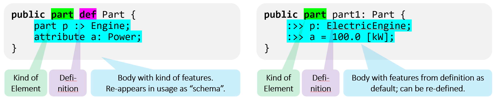

[toc]

---

**Learning objectives** 

The SysML v2 part of the tutorial introduces the SysML v2 textual representation. 
After working through it, the reader

- understands the difference between definition and usage
- is able to define and use parts 
- is able to define and use ports and interfaces 
- is able to define and use constraints
- is able to define and use constraints
- know how to model finite state machines

--- 
# Background 

The SysML v2 language has two representations 
- a _graphical notation_, known as "diagrams"
- a _textual representation_

In this tutorial, we focus on the textual representation.

## Relation to KerML 

SysML v2 is a language for modeling systems that builds on top of KerML. 
From KerML, it uses 
- elements from the abstract representation,
- classes from the KerML libraries, 
- language constructs in particular for defining classes and features. 

## SysML v2 Language Design: Definitions, Usages

In KerML, there are two main kind of elements: Classifiers and Features. 
Most elements of KerML inherit from one of these main classes.
Typically, these elements have separate names (e.g. association versus connector) 
that are well-known and established in the systems modeling community.

However, SysML v2 targets users that are often domain experts, and not from the systems model community.
Hence, SysML v2 introduces definitions and usages.  
Formally, definitions are kinds of Classification, and usages are kinds of features.

In the textual representation, a _definition_ uses the keyword `def` after a keyword for the kind element.
A _usage_  uses the keyword for the kind of element as in the definition, without `def`.




# Data and Calculation 

In SysML v2, attributes model data. 
Attributes must be typed by a data type, e.g., ScalarValues::Real. 
They can be declared by the keyword ```attribute``` followed by a name and/or short name, 
a specialization by a data type, and optionally a binding to an expression that defines its value 
(e.g. ```= 1.0 + 3.0```)

SysMD uses the expression to compute the value of the attribute. 

## Attribute

An attribute definition creates a kind of _Class_ (AttributeDefinition, defined by the SysML library) that is type by a datatype. 
The type can be from the pre-defined datatypes Real, Integer, Boolean, or as well a user-defined data type. 
Attributes may also consist of (own) other attributes. 

An attribute definition can be used in attribute usages where one can redefine its values. 
An example is given below: 

 ```attribute Identification ":>" Type ";" ```

An attribute usage creates a kind of feature (AttributeUsage, defined by the SysML library) 
that is typed by a datatype.
The type can be from the pre-defined datatypes Real, Integer, Boolean, 
but as well as a user-defined data type. 

An attribute usage has (simplified) the following syntax: 

 ```attribute Identification ":" Type [= Expression] ";" ``` 

Below, we give some examples on definition and usage of attributes. 

```SysML::tutorial::sysml::attributes

attribute def Position {
    attribute x: ISQ::LengthValue; 
    attribute y: ISQ::LengthValue; 
    attribute z: ISQ::LengthValue;     
}

attribute p: Position { 
  redefines x = 1.0 [m];
  redefines y = 2.0 [m]; 
  redefines z = 1.5 [m]; 
}
```

Note that SysMD notebook supports modeling and calculation with ranges.
An example is given below.
We use assert to bind _c_ to the value 3.0. 

```SysML::tutorial::sysml::attributes::real
private import ScalarValues::*; 
attribute a: Real = oneOf(1.0 .. 2.0); 
attribute b: Real; 
attribute c: Real = a+b; 
assert { c == 3.0 }
```
SysMD Notebook's solver also computes values that cannot be computed in a direct way.
An example is given below. 
We use assert to bind _d_ to the value true.

```SysML::tutorial::sysml::attributes::boolean
private import ScalarValues::*; 
package boolAttributeExample {
    attribute a: Boolean; 
    attribute b: Boolean; 
    attribute c: Boolean = a and b; 
    assert { c == true }
}
```

## Calculations 

In engineering, one has often re-occurring calculations.
In SysML v2, one can define calculations by the keyword `calc` `def`.
Calculations can be used in expressions as function calls. 

```SysML::tutorial::sysml::calculations
private import ISQ::*; 

// Definition of a Calculation
calc def calcEnergy {
  in v : SpeedValue; 
  in m : MassValue; 
  return result : EnergyValue = 0.5 * m * sqr(v); 
}

// Usage of the defined calculation Energy
attribute a: SpeedValue = 36.0 [km/h]; 
attribute b: MassValue = 200.0 [kg]; 
attribute energy1: EnergyValue = calcEnergy(a, b); 
attribute e: SpeedValue = 72.0 [km/h]; 
attribute f: MassValue = 800.0 [kg]; 
attribute energy2: EnergyValue = calcEnergy(e,f); 
```

# Modeling things 

SysML v2 classifies things, refining the KerML library classes into

- Occurrence – something with a lifetime in space/time; most general thing in SysML v2.
  “Snapshot” means a single point in time.
- Item – occurrence that is in- or output, that can be acted on, e.g., fuel.
- Part – item that is a modular structure of a system, e.g., engine of a vehicle.

Parts are in the SysML v2 library considered as something that is a 
mutable part or component of a system that exists in space and time. 
Following the SysML v2 concept of definitions and usages, there is a
part definition and part usage. 

## Items

Items are structural elements representing entities like water, fuel, or data.
They are used to model for example signals, inputs or outputs of systems. 
An item is typed by the KerML class Occurrences::Occurrence.

```SysML::tutorial::sysml::items
item def Fuel; 
item def Diesel :> Fuel; 

part dieselCar {
    item fuel: Diesel; 
}
```

## Parts 

A part definition introduces a new subclass of ```Parts::Part```. 
Unlike an item, a part is a structural element of a thing and 
can own features, e.g., other parts, items, or attributes. 

Part usages are a kind of Feature.
They are defined as Feature typed by the SysML v2 library class ```Parts::Part```.   
```Part``` is typed by the class KerML::Items::Item
and a subset of the features KerML::Items::items.

As an _example_, we model different kinds of vehicles, 
where each vehicle has a mass, maybe one or more engines and at least two wheels.
Furthermore, we define specific vehicles: 

- A bicycle that is a vehicle that has exactly two wheels and no engine. 

- A car that is a vehicle with body, four wheels and one or two engines 
  (e.g., electrical and combustion).  

Navigate with the _hasA_ treeview left to the respective parts and check its 
attributes!

```SysML::tutorial::sysml::parts
package vehicles {
    package carParts {
        part def Body   { attribute mass: ISQ::MassValue = 100.0 [kg]; }
        part def Engine { attribute mass: ISQ::MassValue = 200.0 [kg]; }
        part def Wheel  { attribute mass: ISQ::MassValue  = oneOf(2.0 .. 50.0 [kg]); }
    }
    
    part def Vehicle {
        attribute mass: ISQ::MassValue = sumOverParts(mass) {
            :>> range = "0..100000"; 
            :>> unit  = "kg"; 
        }
        part wheels [1 .. *]: carParts::Wheel;   
        part engine [0 .. 2]: carParts::Engine; 
    }

    part def Bicycle :> Vehicle {
        :>> wheels [2]; 
        :>> engine [0]; 
    }
          
    part def Car  :> Vehicle {
        :>> wheels  [4 .. 4];  
        :>> engine  [1 .. 2];  
        part body:   carParts::Body; 
    }
}
```

# Connecting things  

A connection is a kind of relationship between parts. 

## Connections

By a connection definition, we can specify which classes and which number of parts can be connected.
By a connection uses, we can create concrete connections; they must satisfy the constraints of its definition. 
```SysML::tutorial::sysml::connections
part def Pad; 
part def Pin; 

// Pure mechanical connection of a Pad to a Pin
connection def ThroughHoleSoldering {
  end part pad: Pad;
  end part pin: Pin;
}

part board {
	part pad241: Pad; // (…) 
}

part microcontroller {
	part pin1: Pin; // (…)
}

connection c241: ThroughHoleSoldering
	connect board.pad241 to microcontroller.pin1;
```

## Ports, Interfaces 

Ports are a kind of part that is intended to connect parts.

```SysML::tutorial::sysml::ports_interfaces
item def BoolSignal {
	attribute value: ScalarValues::Boolean; 
	attribute time: ScalarValues::Real = 0.0;  
}
port def BoolPort {
	in item BoolSignal; 
}
part cpu {
    port clk: BoolPort; 
}
part clock {
    port clk: ~BoolPort; // conjugation by ~ inverses direction
}
interface clockSignal connect cpu.clk to clock.clk;   
```

# Requirements, Constraints and Verification 

A requirement begins with the keyword ```requirement```.
In the body of the statement, there are
- a subject with a name that references an element 
- optionally, a textual documentation
- predicates that shall hold for the subject. 

## Requirements and Constraints

A requirement definition allows users to create a class of requirement 
with a specific infrastructure that is inherited to each usage of 
requirements of the defined requirement kind. 
This can be, for example, attributes or calculations. 

A requirement definition has the following syntax: 

 ```requirement def Identification Body ```

The body specifies the subject by: 

 ```subject Identification references QualifiedName ";"``` 

Also, attributes and calculations can be defined and used. 

An example is given below. 

```SysML::tutorial::sysml::requirements

// Type of things for which we formulate a requirement
part Box {
    attribute w: ISQ::LengthValue; 
    attribute h: ISQ::LengthValue; 
    attribute l: ISQ::LengthValue;   
}

// Requirement, mostly human-readable documentation. 
requirement def volumeRequirement {
    doc /* 
      The box (typed by Boy) shall have minimum volume.
      The volume dependes on with w, height h, length l. 
    */
    subject box references Box; 
    attribute volume: ISQ::VolumeValue = box::w*box::h*box::l; 
}    

// Instance for which we check the requirement
part p: Box {
    :>> w = 100.0 cm; 
    :>> h = 10.0 cm; 
    :>> l = 10.0 cm;     
} 

// Concrete requirement with a constraint   
requirement volumeRequirementUsage : volumeRequirement  {
    subject box references p; 
    doc /* We constrain the requirement to a concrete lower bound. */ 
    require constraint r { volume >= 100.0 [cm^3] }
}
```

## Verification of Requirements and Constraints

For Requirements and Constraints, one should give also a description how to verify them.
This can be done with the ```verification``` statement.
It links the documentation of a requirement and can give additional information on how to 
verify it. 

```SysML::tutorial::sysml::requirements
verification verificationOfVolume {
    subject references p: volumeRequirementUsage; 
    objective testVolume {
        doc /* Human-language description of test */ 
        verify volumeRequirementUsage; 
    }
}
```

# States and Transitions

Finite state machines are modeled by 
- states
- transitions that, 
    - first are in a state, 
    - accept an input, and 
    - then go to another state.   

Finite state machines can have a hierarchy. 

```SysML::tutorial::sysml::stateMachineExample
attribute e1: ScalarValues::Boolean;
attribute e2: ScalarValues::Boolean;  
part part1 {
    state status{
        state state1;
        state state2;
        transition 
            first state1 
            accept e1
            then state2;
        transition 
            first state2 
            accept e2 
            then state1;
    }
}
```

While no calculations are yet done by SysMD for state machines, one can render it.
Navigate in the hasA tree to the state ```tutorial::sysml::stateMachineExample::part1::status```.
Right-click on it. 
Select render graph, and the following automata graph will be shown: 

{width=400 height=220}
