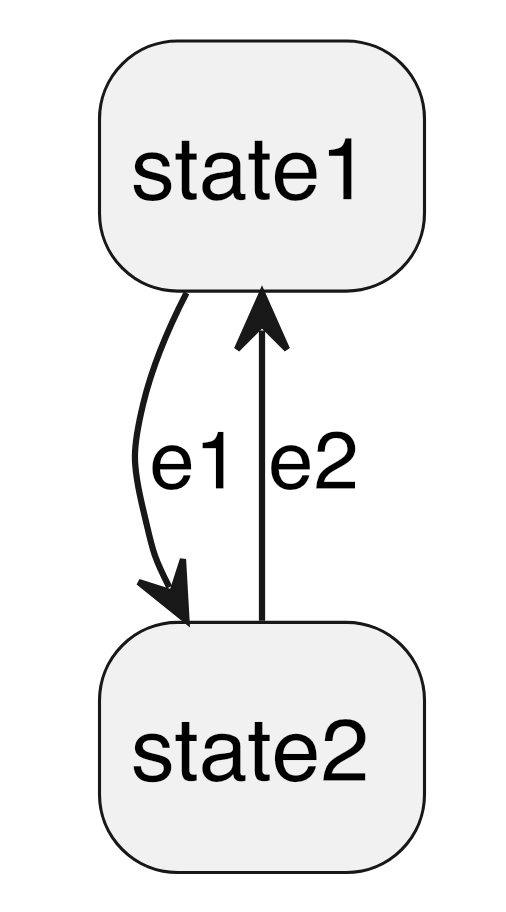

[toc]

---

**Learning objectives** 

The SysMLv2 part of the tutorial introduces the SysMLv2 textual representation. 
After working through it, the reader

- understands the difference between definition and usage
- is able to define and use parts 
- is able to define and use ports and interfaces 
- is able to define and use constraints
- is able to define and use constraints
- know how to model finite state machines

--- 
# Background 

The SysMLv2 language has two variants: 
- a _graphical notation_, known as "diagrams"
- a _textual representation_

In this tutorial, we deal only with the textual representation. 
## Relation to KerML 

SysMLv2 as a modeling language builds on top of KerML. 
From KerML, it uses in particular its semantic library that defines different kinds  
of Classifiers (Classes, Datatypes) and Features. 

All SysMLv2 artifacts are, in the end, specialization of these Classifiers and Features. 

 
## Language design


In SysMLv2 the difference between a _definition_ and a _usage_ is a concept that is found in each
construct: 

- A _definition_ uses the keyword **def** after a keyword that specifies the kind of artifact that is defined
  and introduces a kind of Class. 
- A _usage_ just uses the keyword that specifies the kind of artifact without _def_. 

Example: 
- ```part def P``` introduces a kind of Class of parts named ```P```. 
- ```part p``` creates a part named ```p``` that is a kind of Feature. 
## Inheritance

A definition can have features.
Features are inherited to usages.  
# Attributes

In SysMLv2, attributes model data. 
Attributes must be typed by a data type, e.g., ScalarValues::Real. 
They can be declared by the keyword ```attribute``` followed by a name and/or short name, 
a specialization by a data type, and optionally a binding to an expression that defines its value 
(e.g. ```= 1.0 + 3.0```)

SysMD uses the expression to compute the value of the attribute. 
## Attribute Definition

An attribute definition creates a kind of _Class_ (AttributeDefinition, defined by the SysML 
library) that is type by a datatype. The type can be from the pre-defined datatypes Real, Integer, Boolean, 
or as wwell a user-defined data type. 

An attribute definition has (simplified) the following syntax: 

 ```attribute Identification ":>" Type ";" ```
```SysML::tutorial::sysml
package attributeDefExample {
    attribute def TwoReals {
        attribute firstVal: ScalarValues::Real; 
        attribute secondVal: ScalarValues::Real;     
    }
}
```
## Attribute Usage

An attribute usage creates a kind of feature (AttributeUsage, defined by the SysML library) 
that is typed by a datatype.
The type can be from the pre-defined datatypes Real, Integer, Boolean, 
but as well as a user-defined data type. 

An attribute usage has (simplified) the following syntax: 

 ```attribute Identification ":" Type [= Expression] ";" ``` 

Below, we give some examples.
```SysML::tutorial::sysml
private import ScalarValues::*; 
package realAttributeExample {
    attribute a: Real = 1.0 .. 2.0; 
    attribute b: Real; 
    attribute c: Real = a+b; 
    assert d { c == 3.0 }
}
```
```SysML::tutorial::sysml
private import ScalarValues::*; 
package boolAttributeExample {
    attribute a: Boolean; 
    attribute b: Boolean; 
    attribute c: Boolean = a and b; 
    assert d { c == true }
}
```
# Parts

Parts are in the SysML v2 library considered as something that is a 
mutable part or component of a system that exists in space and time. 
Following the SysML v2 concept of definitions and usages, there is a
part definition and part usage. 
## Part Definition 

A part definition introduces a new subclass of ```Parts::Part```. 
A part can own features, e.g., other parts or attributes. 

As an _example_ shown below, we model different kinds of vehicles, 
where each vehicle has a mass, maybe one or more engines and at least two wheels. 

Furthermore, we define specializations: 

- A bicycle that is a vehicle that has exactly two wheels and no engine. 

- A car that is a vehicle with body, four wheels and one or two engines 
  (e.g., electrical and combustion).  

- A Volkswagen (short: VW) that is a specialization of a Car.

- A BMW, that is short for "Bayerische Motorenwerke," and that is a specialization of a Car. 

Navigate with the _hasA_ treeview left to the respective parts and check its 
attributes!  
```SysML::tutorial::sysml
package vehicles {
    part def Vehicle {
        attribute mass: SI::Mass(0 .. 100000) [kg] = sumOverParts(mass);
        part wheels [1 .. *];                   // Vehicles have wheels 
        part engine [0 .. 2];                   // Vehicles might have an engine   
    }

    part def Bicycle :> Vehicle {
        part wheels [2]; 
    }
          
    part def Car  :> Vehicle {
        part body:   carParts::Body;            // in addition, a car has a body
        part wheels: carParts::Wheel [4 .. 4];  // a car has 4 wheels. 
        part engine: carParts::Engine [1 .. 2]; // and 1 or two engines 
    }
    

    part def <VW> Volkswagen :> Car;
    part def <BMW> 'Bayerische Motorenwerke' :> Car;
    
    package carParts {
        part def Body   { attribute mass: SI::Mass = 100.0 [kg]; }
        part def Engine { attribute mass: SI::Mass = 200.0 [kg]; }
        part def Wheel { attribute mass: SI::Mass  = 50.0  [kg]; }
    }
}
```
## Part Usage 

Part usages are a kind of Feature.
They are defined as Feature typed by the SysMLv2 library class ```Parts::Part```.   
 ```Part``` is typed by the class KerML::Items::Item 
and a subset of the features KerML::Items::items. 
# Connections

A connection is a kind of relationship between parts. 
## Connection Usage and Definition 

By a connection definition, we can specify which classes and which number of parts can be connected.
By a connection uses, we can create concrete connections; they must satisfy the constraints of its definition. 
```SysML::tutorial::sysml
package connection_example {
    part def A; 
    part def B; 
    part a: A; 
    part b: B; 
    connection def C1; // from A to B; 
    connection def C :> C1; 
    connection c : C connect a to b;  
}
```
## Port Usage and Definition

Ports are a kind of part that is intended to connect parts. 
## Interface Usage and Definition 
# Requirements 

A requirement begins with the keyword ```requirement```.
In the body of the statement, there are
- a subject with a name that references an element 
- predicates that shall hold for the subject. 
## Requirement Definition 

A requirement definition allows users to create a class of requirement 
with a specific infrastructure that is inherited to each usage of 
requirements of the defined requirement kind. 
This can be, for example, attributes or calculations. 

A requirement definition has the following syntax: 

 ```requirement def Identification Body ```

The body specifies the subject by: 

 ```subject Identification references QualifiedName ";"``` 

Also, attributes and calculations can be defined and used. 

An example is given below. 
```SysML::tutorial::sysml
package requirementsExample {
    part Box {
        attribute w: SI::Length; 
        attribute h: SI::Length; 
        attribute l: SI::Length;   
    }
    requirement def volumeRequirement {
        subject box references Box; 
        attribute volume: SI::Volume = box::w*box::h*box::l; 
    }    
}
```
## Requirement Usage 
```SysML::tutorial::sysml::requirementsExample
    part p: Box; 
  
    requirement volumeRequirementUsage : volumeRequirement  {
        subject box references p; 
        require r { volume >= 100.0 [cm^3] }
    }
```
# Finite state machines

Finite state machines are modeled by 
- states
- transitions that, 
    - first are in a state, 
    - accept an input, and 
    - then go to another state.   

Finite state machines can have a hierarchy. 
```SysML::tutorial::sysml
package stateMachineExample {
    attribute e1: Boolean;
    attribute e2: Boolean;  
    part part1 {
        state status{
            state state1;
            state state2;
            transition 
                first state1 
                accept e1
                then state2;
            transition 
                first state2 
                accept e2 
                then state1;
        }
    }
}
```
While no calculations are yet done by SysMD for state machines, one can render it.
Navigate in the hasA tree to the state status and right-click on it. 
Select render graph, and the following automata graph will be shown: 

{width=400 height=220}
