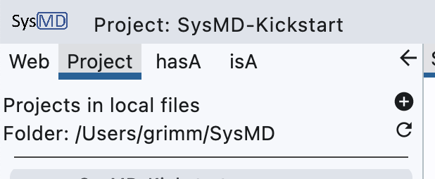
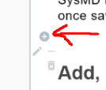

[toc]
# SysMD Notebook

We distinguish between SysMD Notebook *tool* and the SysML v2 *language extensions* SysMD.

The *tool* permits editing *documents* that consist of *cells* that can be
- documentation written in Markdown, or
- models written in the language SysMD itself.  
- 
The *language extension* extends SysML v2 to better support 
- interactive work,  
- integration in Notebook-like environments, 
- formulation of constraints and ranges for which the expression syntax is carefully extended.

In the following, we first give an introduction to the SysMD Notebook, and then a  
brief overview of the SysML v2 textual language constructs as supported by SysMD. 
## Create a new SysMD Project

To create a new SysMD project, select the rider “Projects” and navigate to the small “+” 
(see screenshot; alternatively: right-click). 

{width=400 height=120}

By clicking on the small “+” we create a new SysMD Project, once saved, in a Markdown-File.
Its location is defined by the line below; it defines the directory in which projects are saved or loaded; 
each in a folder given by the project name.
After clicking on “+” SysMD Notebook asks for the project name and a description. 
Enter a project name and a description.

The project file starts with a cell that includes a YaML header which 
that has some relevant information on the project.
SysMD renders the information in the YAML header of the Markdown file.
It allows users to interactively edit the following information: 

- Title and project maintainers or authors,
- A logo or icon,
- The project name, 
- Files which belong to the project relative to the project file,
- Project usages (other projects that are used by this project)

Double-click on the title cell of this tutorial to get an example.

## Add, Delete, Edit Cells of a SysMD Document
A SysMD Document (File) is structured into *cells*. 
A cell can be of the kinds

- _Documentation_ that is written in the "Markdown" Language that is between a 
  What-You-See-Is-What-You get Editor like Word or Excel and pure text. 
  Markdown allows us to document our model in a structured way, including a document structure 
  (Chapters, Sections, etc.), Pictures, Tables. 
  This helps us to better explain how we came to requirements – and others to understand it as well. 
  In SysMD, Documentation is tightly interwoven and linked (via Relationships) with more formal, textual models.
  
- _Textual representation_ of a model. 
  We can formulate models in the modeling languages SysMD or a subset of SysML v2 textual. 
  Both languages are translated into SysML’s KerML metamodel class instances and can be exchanged via the SysMLv2 API. 
## Add and Delete Cells
A new SysMD document is empty in the beginning. 
To add a cell, click on the small gray circle with a "+" that is shown. 



It adds a document-cell, either in the start, the end or between existing cells.
Now you have created your first document-cell.
Left of each document-cell, icons are shown. 
If an element is not selected, they are gray;
if an element is selected, the icons are in different colors. 
If the mouse is over an icon, SysMD notebook shows an explanation what action is done when clicking the item. 
To delete an element, select the trash bin, to edit the pencil, 
and to minimize the document-cell, select the “-”.
## Documentation vs. Code-Elements. 
Markdown is _easy_ to learn, efficient, and effective.
The following text shows how to create a third level heading, how to emphasize; 
just to give you an example. 

*Double-click into the cell below!*  
### Third level Heading; click here! 

Below an item list:
- This is *emphasized*.
- This is **Bold**.
- This is ++underlined++.
- This is ~~strikethrough~~. 

Double click into this cell to edit it.
You want to learn more on Markdown? 

[[Learn more about markdown by clicking this link!]](https://www.markdownguide.org/getting-started/)

Note that SysMD Notebook also renders LaTeX equations like $\alpha = \sum_{x=0}^{100} x$.
# SysML v2 textual and SysMD extensions
## Setting up a model
### Project configuration
Click on the page heading to see and edit the configuration of a project. 
The configuration is saved as a YAML header of the overall Markdown file 
which is used for "human-readable" project exchange with various stakeholders. 

The heading includes
- the project's name: a project is identified by its name or a UUID not visible to the user. 
- the project's description
- the usage of other projects: 
  A model usually depends on other models that need to be read from a file or database into the current model. This is called  ```usage```.
  The usage is specified in the YAML header 

### Packages 
It is a crucial practice to avoid a hierarchically flat model. 
A good practice is to structure projects into different packages.
For the kickstart we put everything in the package ```kickstart```.
The package is created as follows: 

```SysMD
package kickstart; 
```

Run this statement and check in the tree view left under _hasA_ what has been added: 
Initially, there are only the KerML standard libraries. 

### Import of namespaces
Other namespaces can be imported to simplify the notations.
For example, the standard package ```ScalarValues``` introduces standard data types like: 
- Real
- Boolean
- Integer

To use an element from another package like ```ScalarValues```, one has to do this by its fully
qualified name, i.e., an attribute of type Real has to be declared by ```ScalarValues::Real```.
By importing the namespace of the package ```ScalarValues``` we can access it
by its simple name as follows:
```SysMD::kickstart
  import ScalarValues::*;             // Allows us shortcuts to Real, Integer, etc. 
  attribute r: Real = 2.0 .. 3.0;     // assigns r a value from the range 2 to 3.
  attribute i: Integer = 2;           // assignas i the value 2.  
```
Note that with SysMD extensions we attach the cell above to the package ```kickstart```;
hence, we work in this cell inside this package.
This pattern of extending elements allows us to deviate from the linear ordering 
of adding model elements to packages.
This allows us to mix modeling and description in different cells 
and permits to stepwise explain and introduce an element.

## Constraint propagation of values

One of the main features of SysMD Notebook is that it propagates constraints and checks the 
consistency of values and units.

### Ranges
For execution in the sense of constraint propagation, we use the following profile:
```Markdown
    standard library package ScalarValues {
        datatype Real :> Number {
            feature min: Double;
            feature max: Double;
            feature all: Boolean; 
        }
        // ... similar for Integer, Boolean (true, false, unknown, not satisfiable) 
    }
```
This datatype is internally used to represent values from the Reals, where
- _min_ is a known lower bound,
- _max_ is a known upper bound,
- _all_ specifies whether the constraint system shall be satisfied for at least one or all values in the range _min .. max_.

Below, we give some simple examples. 

#### Example 1: Real values and its dependencies
Below, we give an example for SysML v2 textual code. 
Note that all values are constraint to some ranges in different units.
Also note that there are dependencies between all the values: 
- From the height, width, length to the volume
- From the volume to the height, width, length
- Also in-between height, width, etc.

_To calculate consistent values for all the above quantities considering the
dependency ```volume = height*width*length```, click on the calculator symbol left.
To display the values, click on the i in a circle left of the cell._
```SysMD::kickstart
    import SI::*; 
    part rangeExample {
        attribute height:  Length = 10.0 .. 100.0 [cm];
        attribute width:   Length = 1.0 .. 1.1 [m];
        attribute length:  Length = 1.0 .. 1.1 [m];
        attribute volume:  Volume(1000 .. 2000) [l] = height * width * length;
        // Same as: 
        // assert a { (volume >= 1000.0 l) and (volume <= 2000.0 l)}    
    }
```
_Exercise:_ Try different values, units.
#### Example 2: Boolean values and its dependencies

Boolean values can be instantiated via the class ```Boolean``` that is declared 
in the package ```ScalarValues```. 
This package is imported by default, so we don't have to import it.
```SysMD::kickstart
    package booleanExample {
        attribute a: Boolean;
        attribute b: Boolean;
        assert c { a and b }
    }
```

#### Example 3: Hybrid (mixed Boolean/arithmetic) dependencies

Let's mix Boolean and arithmetic dependencies. 
This time, we give dependencies that are not satisfiable.
We use two arithmetic values, ```a, b``` and a Boolean condition ```c``` that shall be true.
```SysMD::kickstart
    package hybridExample {
        attribute a: Real(1.0 .. 2.0); 
        attribute b: Real(1.1 .. 2.1) = a + 0.1; 
        assert c { a > b }
    }
```
_Exercise:_ In place of ```>``` try the relations ```<, ==``` .


#### Units

Even more, the concrete values of a property or the multiplicity of a feature can be constrained by dependencies; then, SysMD notebook computes the possible values while considering all constraints.
The library SI of SysMD supports

- SI units with prefixes,
- derived units,
- many national unit systems,
- per-cent notations,
- logarithmic units (Decibel).
- units for digital information (e.g., KiB, MB)

Note that in SysML v2 standard the package with dimensions is ```ISQ```.
We will change the name in future versions.

Units are converted automatically before computations are done, and the consistency of units in equations is checked:
the unit left of a dependency, and the unit right of it must be convertible into each other.
```SysMD::kickstart
    package unitsExample {
        import SI;  
        attribute t: Length [s]            = 1.0 [s];
        attribute v: Speed [m/s]           = 3.0 [m/s];
        attribute g: Accelleration [m/s^2] = 4.0 [m/s^2];
        attribute s: Speed [m/s]           = sqrt(sqr(v)+sqr(g)*sqr(t)); 
    }
```
Play with the units, e.g., by changing the unit after the type declaration or try ms instead of s. 

For date and time, the ISO format is supported.
We can add and subtract times in this format.
```SysMD::kickstart::unitsExample
    attribute date: SI::Time [DateTime] = DateTime("2021-10-10T03:00:00");
    attribute time: SI::Time [a] = 1.0 a;
    attribute dateResult: SI::Time [DateTime] = date + time;
```


### Vectors
There is also the possibility to use vectors instead of scalar values.
They can be used with the same operations as normal values in addition to some special
operations like angle or cross-product. 
Here is an example for defining vectors:
```SysMD::kickstart
package vectors {
    attribute a: Real(0.0..1.0,1.0..2.0) [kg] = (0.5,1.5) kg; 
    attribute b: Real [kg] = (0.5,1.5) kg; 
    attribute c: Real(-5.0..-1.0,-1.0..2.0, 2.0..4.0) [kg] = (-5.0, -1.0, 3.0) kg; 
}
```
In the next example, there is a calculation with Vectors with the cross-product and angle.
```SysMD::kickstart::vectors
    attribute a2: Real(1..1,5..5,10..10);
    attribute b2: Real(5..5,1..1,10..10);
    attribute c2: Real  = a2 cross b2;
    attribute d2: Real[°] = angle(a2,b2); 
```

## Types and Functions in Expressions
SysMD supports the following types:

- ```ScalarValues::Real```
- ```ScalarValues::Integer```
- ```ScalarValues::Boolean```
- ```ScalarValues::String```

In expressions, the following functions can be used:

- ```ceil(x)``` - rounds a Real x to next higher Integer.
- ```floor(x)``` - rounds a Real x to next lower Integer.
- ```exp(x)``` - exponential function of a Real x.
- ```log(x)``` - natural logarithm of x
- ```power2(x)``` – computes 2 to the power of x
- ```powerb(base, x)``` – base to the power of x
- ```sqr(x)``` - square of x
- ```sqrt(x)``` - square root of x
- ```linear(a, b, c, d, …)``` – linear interpolation through pairs of values specifying (x, y).
- ```ITE(condition, if, else)``` – ITE function; if Condition then if-value, else then-value
- ```sum_i(...)``` Iteration over i – Not for IRIS.
- ```not(x)```
- ```a and b```
- ```a or b```

*Additional functions are available that permit computing over collections of values.*

#### Functions over collections of values

SysMD also has pre-defined functions that query values and calculate aggregations over the collection. 
Examples are the functions 

- ```sumOverParts(lambda-expr)``` 
- ```productOverParts(lambda-expr)```
- ```sumOverSublasses(lambda-expr)```
- ```productOverSubclasses(lambda-expr)```
- ```bySubclasses(expression)```

These functions take an expression as a parameter that is evaluated as a lambda expression in the scope
of parts owned by or subclasses of an element. 

For example, the function ```sumOverParts``` executes the ```lambda-expr``` in 
each part of the current element and returns the sum of it. 
The function is transitive; it will recursively search aggregate the executions in parts of parts etc.
If this should not be done, the function _sumOverPartsNotTransitive_ can be used.
This function only looks in directly owned parts.
Instead of the sum, the product can be also calculated with the function _productOverParts_.

#### Functions over specializations

For some classes, its properties might be clear;
e.g., for bicycles we can guess its mass, or for cars as well.
But it can be challenging the more abstract we are in the taxonomy.
What is the possible mass of arbitrary vehicles?
SysMD can help by the function bySubclasses.
However, note that the function ```bySubclasses``` does not add constraints; it just computes the
possible mass by the consistent values of its subclasses.
And this intention is shown in the textual model by having no specific constraint besides the fact that it is some Real-valued quantity.


## Classification and Featuring 

Modeling a domain mostly uses two relationships: 

- Classification. This means, we give a kind of taxonomy in which parts are classified regarding common features.
- Featuring. This means, we describe features and its amount that a part may have. 

In the following, we give an example:a model of the domain _Vehicles_. 
We first create a package that defines vehicle parts and add e.g., an engine and wheels to it.
Then, we can explain what differentiates a bicycle from a car.
Reminder: we can access the elements of this package from the package of
vehicles via its path as shown in the example below.

```SysMD::kickstart
    package carParts {
        part def Body {
            attribute mass: Mass(300.0) [kg];
        }
        part def Engine {
            attribute mass: Mass(300.0) [kg];
        }
        part def Wheel {
            attribute mass: Mass(50.0) [kg];
        }
    }
```
As can be seen, we can now make statements about the different kinds of vehicle's different features.
This is done by listing them as a feature using the hasA relationship.
Generally, each feature is listed with:

- Name (i.e. ```wheels```), followed by a double point,
- Amount (multiplicity), that is a range of Integers like (i.e. [4..4]),
- Class, that is what class describes the feature (i.e. “CarParts::Wheels”).

### Classification 

For modeling a domain, we typically start with a taxonomy that classifies and explains the kind of things in a domain. 
For example, if we model Vehicles, we can classify different kinds of vehicles. 
Taxonomies are trees with a single node as root, some internal nodes, and leaves. 
In SysML v2, we hence always have a single root of all types: the node “Anything.”
It is the default class if nothing else is specified. 
Classes of the domains are then broken down to the most specialized classes that are 
the leaves of the taxonomy:

- The root node (Anything) is the most general class
- Towards the leaves, classes become more and more specific.

To model the taxonomy, we use the relationship “specializes.” 
In SysML v2 this is done by using the Keyword ```specializes``` or the shortcut ```:>```. 
definitions are directly visible only inside a package. 
In SysML v2 there are part definitions (```part def```) and part usages (```part```). 
The definitions create a kind of class; the usages create an instance. 
Part definitions and usages can feature parts and attributes. 
Specializations inherit features. 

```SysMD::kickstart
    package vehicles {
        // We consider a vehicle to be anything that has at least one wheel. 
        // The bySubclasses determines a consistent value for mass with min diameter. 
        part def Vehicle {
          attribute mass: SI::Mass(0..1000) [kg] = bySubclasses(mass);
          part wheels: carParts::Wheel[1 .. *];        
        };
        
        // A car is a vehicle with Body and Engine. 
        // the sumOverParts determines a consistent minimal range consistent with parts.
        part def Car  :> Vehicle {
           attribute redefines mass: SI::Mass(0 .. 1000)[kg] = sumOverParts(mass); 
           part wheels: carParts::Wheel[4 .. 10]; 
           part body:   carParts::Body;
           part engine: carParts::Engine;
        };
        
        part def Bicycle :> Vehicle {
           attribute :>> mass: SI::Mass = 10.0 .. 20.0 [kg]; 
        }
        part def VW   :> Car;
        part def BMW  :> Car;
    }
```

Besides a decomposition into further elements, we can also model some numerical or 
Boolean properties. They may also have a physical unit. Then, we specify:

- Name (i.e., mass)
- The specified type and range (i.e., Real (100 .. 100)
- The required unit  (i.e, [kg])

## User defined Calculations

There is also a possibility to define user defined functions with any number of input variables . 
These functions can be defined once and used multiple times.

```SysMD::Global::kickstart    
    package CalculationExample {
    
        // Definition of a Calculation
        calc def Energy {
          in v : ScalarValues::Real [km/h]; 
          in m : ScalarValues::Real [kg]; 
          return result : ScalarValues::Real [J] = 0.5 * m * sqr(v); 
        }
    
        // Usage of the defined calculation Energy
        attribute a: ScalarValues::Real [km/h] = 36.0 [km/h]; 
        attribute b: ScalarValues::Real [kg] = 200.0 [kg]; 
        attribute energy1: ScalarValues::Real[J] = Energy(a, b); 
        attribute e: ScalarValues::Real [km/h] = 72.0 [km/h]; 
        attribute f: ScalarValues::Real [kg] = 800.0 [kg]; 
        attribute energy2: ScalarValues::Real [J] = Energy(e,f); 
    }
```

## Inheritance

As of now, we skipped one important thing: inheritance. 
Inheritance allows us to reduce the modeling effort, 
and the Liskov principle is the basis for sound semantics when we reason
about possible configurations. 
What does the **Liskov-Principle** mean? In simple words:

>“A specialization can always replace its superclass.”

What is its impact? 
If we ask for a vehicle, all of its subclasses - i.e., bicycle, car, and subclasses thereof - would satisfy our modeled needs. 
In other words, if we specify that we want a class, all of its subclasses are 
possible variants. In our example, variants or possible solutions would be:

- Bicycle
- Car, including its specializations 
  - VW 
  - BMW

Of course, this is only possible if the Liskov principle holds. 
To support this, SysMD's semantics of inheritance for ranges and constraint propagation
strictly follow this principle. 
When we define a specialized type, it inherits everything from the general type such that it is fulfilled.
Note that this does not mean that subclasses must be similar to its superclasses. 
Subclasses can have additional features, but not limitations. 
This is checked by the SysMD solver.
A VW and a BMW can differ from a generic “Car.” 
But only in a way such that the Liskov principle holds. 
Assume, we model the power of Cars and its subclasses as follows:

```SysMD::kickstart::vehicles
    // Interactive scription with SysMD -- NOT SysML v2 syntax. 
    // Modifies existing model
    Car hasA attribute power: SI::Power(10 .. 1000) [kW].
    VW  hasA attribute power: SI::Power(20 .. 100) [kW].
    BMW hasA attribute power: SI::Power(150 .. 400) [kW].
```

These specifications are consistent with the Liskov principle: 
If one wants a car with a power from 10 to 1000 kW, 
a VW or BMW will satisfy this constraint. However, if we change the specification 
of VW to a power of max. 1100 kW, this is in contradiction to line 1 which says 
that all vehicles have a power in the range of 10 to 100 kW. 
Then, SysMD notebook displays an error!

Note that 
- features and hence, attributes, calculations or expressions are first inherited, that means we 
create a concrete clone of it that can take values independent of its superclasses' values. 
- then, in a second step, the Liskov principle is checked as above on the constraints given for the (sub)-type; 
violations are reported as errors and not "repaired" by constraint propagation. 
Note that if NO constraints are given, SysMD just uses the supertype's constraints. 
- finally, the expressions are evaluated by constraint propagation. 

The below example demonstrates this behavior.
```SysMD::kickstart
    package inheritanceExample {
        part def Coin {
            attribute diameter: SI::Length(5..200) [mm];
            attribute circumference: SI::Length [mm] = diameter*3.141; // 15.7 .. 628.2 mm 
        }
        
        part oneEuroCoin : Coin { 
            attribute diameter: SI::Length [mm] = 23.25 mm; 
            // circumference is inherited. Must be re-evaluated with correct diameter.
            // Expected behavior:  re-evaluate dependency in new scope, but without changing diameter of Coin. 
        }
    }
```
