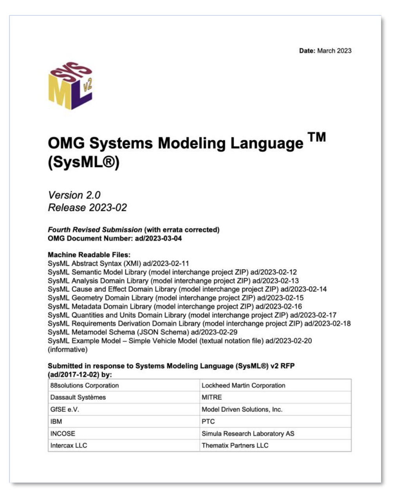

[toc]

---
**Learning objectives**

In this part, you will learn about for which purpose and how to use SysMLv2.
After reading this section, you will

- know about the features of SysMLv2 tool ecosystems

- understand
    - when to use SysMLv2 and when not
    - for which purposes to use SysMLv2 and for which to use other tools or languages

---
# What is SysML? And SysML "v2?" 

SysML (“Systems Modeling Language”) is a standard for Model-Based Systems Engineering.
The standard is developed and provided by the Object Management Group (OMG). 
SysML allows us to model and exchange
- Requirements
- Specification
- Use cases
- Test cases

SysML provides a rather *general language* for arbitrary domains, including software, 
digital hardware, mechanical components, and many other domains. 
SysML is hence suitable for modeling systems that combine multiple domains.

Often, different domains have established domain-specific solutions. 
These are usually highly optimized for e.g. microelectronic systems.
Then, SysML can nicely be used for crossing different domains, by 
linking them with system requirements (e.g. safety of an automobile), 
and associated use-, analysis, and verification cases.  

{width=1000 height=400}

SysML **v2** is the latest version of SysML.
However, version 2 is not a simple “update” of v1.X.
Compared with a previous version of UML and SysML, it is mostly entirely new, but not entirely different. 
The SysML v2 standard includes

- KerML, a new metamodel that is, unlike in earlier versions, not based on UML. 
- SysML v2 diagrams, 
- SysML v2 textual modeling language, 
- SysML v2 API, in particular a REST API. 
# SysMLv2 in Systems Engineerig and Development Process  

As mentioned above, SysML v2 is not a domain-specific tool development or for modeling/simulation.
Its use cases go over the whole development where it provides the "glue" between diferent domains. 
A reasonable methodology to use the SysMLv2 ecosystem might be as follows: 

**Requirements elicitation** Documentation and organization of stakeholder needs. 
For this purpose, documents in natural language, but as well figures, equations, 
and more are used. 

**System specification** Specification and analysis the intended implementation resp. its functionality, 
and linking functions with requirements and test specifications. 
This in particular includes also specification of use- , analysis- and test cases.  

**Development** Development of components that implement functions and that are tested based on the specification. 

**Safety and hazard assessment** Analysis of faults and its impacts.

**Production** Result of the development process is a cloud database that includes all parts and its variants. 
This can be used as a bill of materials (BOM) for production, and complementary information can be added to the models.

**Operation** The BOM derived from the SysMLv2 model, together with complementary behavioral models for testing and 
verification can be used as a starting point for a digital twin that liks Development and operation. 
 
# SysML v2 Ecosystem   
A typical SysML v2 ecosystem might consists of 

- _Frontend tools_ for different purposes including all activities of a product life cycle.
  This includes SysMD Notebook which is in suitable particular for systems engineering.
  Other use cases might involve e.g. change management of modeled parts. 

- A _backend_ in the cloud in which model elements are persisted and versioned. 
  A backend functionality can be done in two ways: 
  - A simple _file/text-based_ backend in which text is persisted. 
    This is suitable during developing models and documentation.
    Version management can then be done with Git which is well suitable for text-based 
    artefacts, i.e., source code.  
  - A complete _object oriented versioning_ by a repository, e.g. in the web in which versions of the modeled elements
    are persisted and can be tracked. 
    This is suitable for version management of large projects in which e.g. different tools
    are used for e.g. change management for single parts. 

- _Libraries_ that are very specific for different domains and use cases.  

SysMD Notebook is basically a frontend tool for early analysis in systems engineering with 
- integrated file/text-based persistence of models and documents that can be versioned with Git, and
- a REST API to an object data base for usage of models with object oriented versioning. 
  Agila is an example for such a data base. 

With such a scenario in mind, the SysMLv2 standard goes beyond the scope of a pure 
modeling language! 
The SysMLv2 standard hence covers the following aspects: 

**KerML** KerML is the metamodel and a basic modeling language. 
It provides basic modeling artefacts ("classes"), e.g. Types, Classes, Features, Expressions, 
and semantic libraries based on these artefacts.
KerML can be represented by 
- An abstract representation of instances of the metamodel classes. 
- KerML Textual representation

**SysMLv2**, a language for Systems modeling with basic constructs based on KerML. 
SysMLv2 models can be represented by
- SysML v2 Diagrams 
- SysML v2 Textual notation

In the tutorial we focus only on the textual notation. 

**API** The SysMLv2 standard also specifies interfaces for model exchange and versioning: 

- For a cloud-based environment, a REST API and OSLC endpoints are specified. 
- For file-based use cases, file format for projects is specified. 

In the tutorial we cover all above aspects: 
- KerML introduces the basic metamodel for SysML v2.
- SysML introduces basics of the SysML v2 textual modeling languate. 
- API gives a brief introduction into the REST API.   
